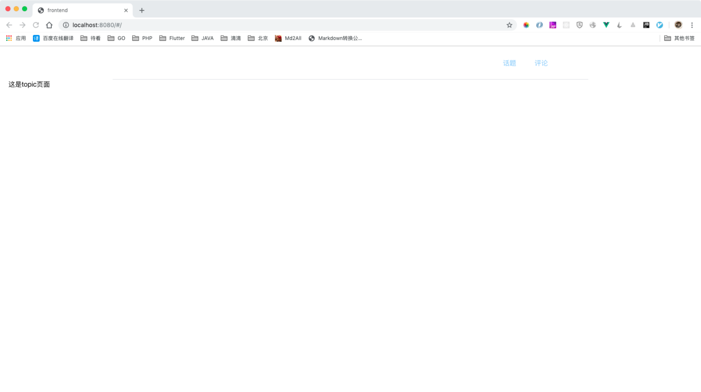

# 创建header

我们在没有设计的前提下，最大的问题就是css没有，所以我们需要借用其他css来进行展示

我想借鉴的是饿了么官网的css（https://element.eleme.io/#/zh-CN/component/layout）它的源码在github上已经有了

# css

首先，我直接拷贝header的css到我们的header.vue中。（https://github.com/ElemeFE/element/blob/dev/examples/components/header.vue）

这里需要注意的一点，这里的style的语言是scss，由于我们之前安装vue脚手架的时候选择了支持sass，所以这里我们是可以直接拷贝过来使用的。之前没有选择，则需要额外安装了。


# route-link

下一步，我们需要加入route-link，就是vue-router。

这一步其实是一个大动作，要做一个真正的单页模型，我们需要建立一个有公共的头部，尾部的页面，中间部分是根据不同的链接进行的。所以我们需要使用vue-router。

先导入这个包：`npm install vue-router`

我们可以看到在package.json中多出来了`"vue-router": "^3.0.6"`

然后现在的目录构造就应该是这样了，

创建route.config.js，里面存放的主要是路由信息。
```

import App from './App'
import Topic from './components/topic/index'
import Comment from './components/comment/index'

let routes = [
    { path: '/', component: Topic},
    { path: '/topic', component: Topic },
    { path: '/comment', component: Comment}
]
  
export default routes
```

然后在main.js中引入这个route，并且使用上vue-router

```
import Vue from 'vue'
import VueRouter from 'vue-router'
import ElementUI from 'element-ui'
import 'element-ui/lib/theme-chalk/index.css'
import App from './App.vue'
import MyHeader from './components/header'
import routes from "./route.config.js";

import './assets/styles/common.css';
import './assets/styles/fonts/style.css';


Vue.use(ElementUI)
Vue.use(VueRouter)
Vue.component('my-header', MyHeader)

const router = new VueRouter({
  routes // (缩写) 相当于 routes: routes
})

new Vue({
  router,
  render: h => h(App)
}).$mount('#app')
```

然后App.vue里面就是
```

<template>
  <div id="app">
    <el-container>
      <el-header>
        <my-header></my-header>
      </el-header>
      <el-main>
        <div class="main-cnt">
          <router-view></router-view>
        </div>
      </el-main>
      <el-footer></el-footer>
    </el-container>
  </div>
</template>

<script>
export default {
  name: "app",
  data() {
    return {};
  }
};
</script>

<style lang="scss">
</style>

```
做下解读，这里就是说整个页面是单页，所有路由由route.config.js托管，里面的/就是默认，它触发到的是components/topic/index.vue。这个index.vue并不是整个页面，它的整个页面还是去寻找#app, index.vue只是替换其中的`<router-view>`标签。

然后在header中就可以使用`<router-link>`标签
```
<li class="nav-item">
    <router-link 
    active-class="active"
    :to="`/topic`">话题</router-link>
</li>
```
于是启动就可以看到需要的

# 结束

至此，vue-router安装完成，header基本也完成