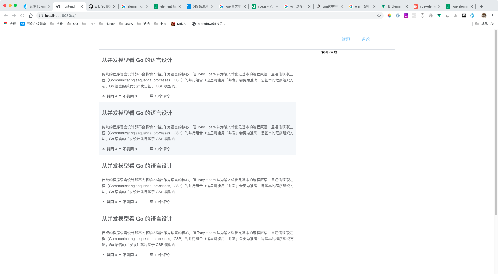

# 话题列表页

我这个的目标是制作话题列表页

首先设想的话题列表页面是一个大的el-table标签实现的。其中每个元素都是一个自定义的item元素。这里就有一个点，如何把父的数据，传递给子的数据呢？

答案是使用prop。

components目录下的topic文件夹有两个文件，一个是index.vue，一个是item.vue。

对于item.vue
```

<template>
  <div>
    <el-link :underline="false">
      <h2>{{topic.title}}</h2>
    </el-link>
    <p v-html="topic.summary"></p>
    <el-row>
      <el-col :span="6">
        <div>
          <el-link :underline="false" icon="el-icon-caret-top">赞同 {{topic.like_count}}</el-link>
          <el-link :underline="false" icon="el-icon-caret-bottom">不赞同 {{topic.unlike_count}}</el-link>
        </div>
      </el-col>
      <el-col :span="6">
        <el-link :underline="false" icon="el-icon-s-comment">{{topic.comment_count}}个评论</el-link>
      </el-col>
    </el-row>
  </div>
</template>
<script>
export default {
  name: "topicItem",
  props: ["topic"]
};
</script>

```
这里主要有几个点，首先，props传递进来一个topic属性，然后内部就可以使用{{topic.title}}等进行绑定了。

其次，topic.summary是一个富文本，它有html标签，这里想要显示它就要使用v-html这个标签。

对于index.vue中重要的部分：
```

<template>
  <div class="container">
    <el-row>
      <el-col :span="16">
        <div class="grid-content">
          <el-table :data="topics" style="width: 100%" :show-header="false">
            <el-table-column>
              <template slot-scope="scope">
                <topicItem :topic="scope.row"></topicItem>
              </template>
            </el-table-column>
          </el-table>
        </div>
      </el-col>
      <el-col :span="2">
        <div class="grid-content bg-white"></div>
      </el-col>
      <el-col :span="6">
        <div class="grid-content">右侧信息</div>
      </el-col>
    </el-row>
  </div>
</template>
```
这里使用了el-table，它的:data是topics，然后在每个el-table-column中，它使用了自定义的topicItem结构，这个结构传递一个属性:topic，它定义未这个column的数据。
```

import topicItem from "./item";
```
这里引用了item这个组件



# 总结

这里主要联系了父组件往子组件传递数据的操作。